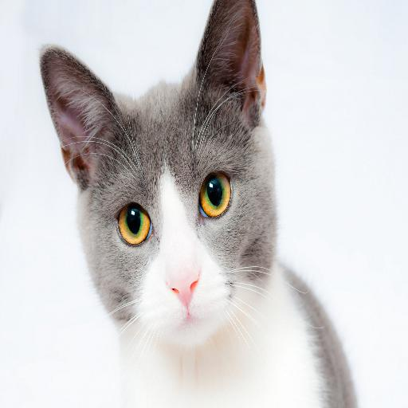
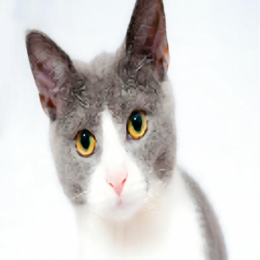

# Image Super Resolution using a Multi-Resolution Deep Laplacian Neural Network
In this repository, I attempted to implement a convolutional neural network that increases the resolution of a photo by 2 and 4 times. The algorithm is based on the one described by Wei-Sheng Lai and colleagues, but I adapted it to suit my computational limit (i.e training using only one GPU on Colab for a few hours).

## Training Details:
I use the Microsoft COCO dataset as training data. I resize each image first to 512 by 512, then crop a square patch of size 128, randomly flipping the image horizontally and interpolate by a random amount of scale between 0.5 and 1.0 (using the nearest neighbor mode for speed). I also use the pixel shuffle convolution for upsampling instead of transposed convolution.
 
I train for only 10 epochs using Adam optimizer with default setting, which means that the results could be much better with more hyperparameter tuning or longer training.

## Reproduction
Code for training can be found in test_superres.py, and code for inference can be found in test_inference.py. Note that this project made use of my [nn-toolbox](https://github.com/nhatsmrt/nn-toolbox/tree/experimental/nntoolbox) for various components and training procedures (you might want the experimental branch for latest updates). It also use another repository of mine for the computation of the SSIM metric, generative-models, which is unreleased.
 
Pretrained weights can be downloaded [here](https://drive.google.com/file/d/1YwTJr8VPYibOYLXh3JdKNkp1JJZDomXD/view?usp=sharing).
## Results
The high resolution image is first resized using bicubic interpolation to obtain a lower resolution version. This version is then upsampled by both the neural network and the bicubic algorithm for comparison.
### Cat 1:

Original high resolution image:

Super resolution using bicubic (PSNR: 24.6858, SSIM: 0.8688):

Super resolution using neural network (PSNR: 25.2227, SSIM: 0.8738):

## Cat 2:

Original high resolution image:

Super resolution using bicubic (PSNR: 27.5483, SSIM: 0.8965):

Super resolution using neural network (PSNR: 27.3232, SSIM: 0.9014):

## References:
1. <em>Wei-Sheng Lai, Jia-Bin Huang, Narendra Ahuja, Ming-Hsuan Yang.</em> Deep Laplacian Pyramid Networks for Fast and Accurate Super-Resolution. https://arxiv.org/abs/1704.03915

2. <em>Wei-Sheng Lai, Jia-Bin Huang, Narendra Ahuja, Ming-Hsuan Yang.</em> Fast and Accurate Image Super-Resolution with Deep Laplacian Pyramid Networks. https://arxiv.org/abs/1710.01992

3. COCO dataset: http://cocodataset.org/#download
Licensed under a Creative Commons Attribution 4.0 License.
